### Rappels

* Quelle est votre adresse IP ? Quelle est sa classe (IPv4) ?
* Quel est votre masque de sous-réseau ?
* Quelle est l'adresse de votre passerelle ?

Contexte :

VM1 :

- Windows 10 dans VMWare.
  Connecte en NAT.
  Utilisateur dans le domaine

VM2 :

- Windows Serveur
  Connecte en NAT.

PC perso

## Voici une capture d’écran du VM1

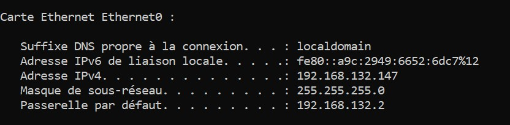

Concernant la classe de l'adresse IPv4, elle est de classe "C" car se trouve dans une environment VMWare.

### Questions

## 0. Quels sont les `flags TCP` ?

Il y a **9 flags principaux** utilisés pour le contrôle de la connexion et la gestion des données.
URG, ACK, PSH, RST, SYN, FIN, ECE, CWR, NS.

Combinaisons typiques :

- **SYN** → début de connexion.
- **SYN + ACK** → réponse à une demande de connexion.
- **ACK** → accusé de réception normal.
- **FIN + ACK** → fermeture propre de connexion.
- **RST** → connexion rejetée ou interrompue.

En appliquant un filtre TCP on peut voir plusieurs, voici des captures d'écrin avec les combinaison typiques dans la VM2 :

- **SYN sans ACK** (début de handshake)

  ```
  tcp.flags.syn == 1 && tcp.flags.ack == 0
  ```
- **SYN + ACK** (réponse au handshake)

  ```
  tcp.flags.syn == 1 && tcp.flags.ack == 1
  ```

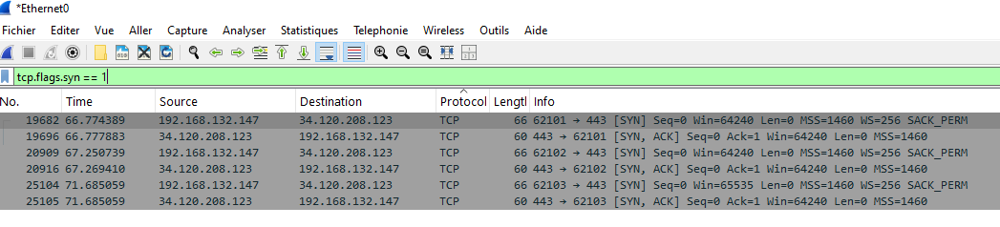
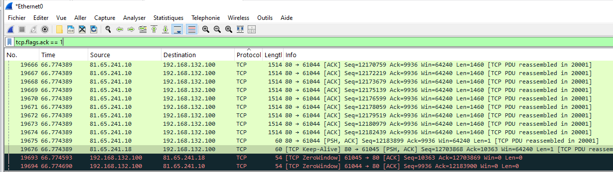
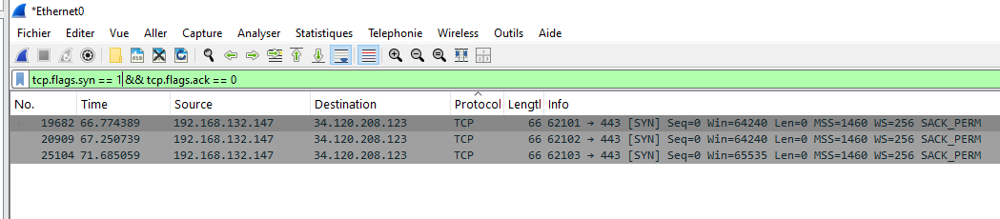
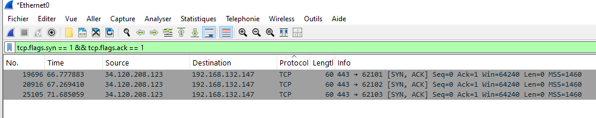

---

## 1. Capturer le processus `DORA` du protocole DHCP

En cmd `ipconfig /release` -> `ipconfig /renew` dans le PC perso pendant la capture WS :

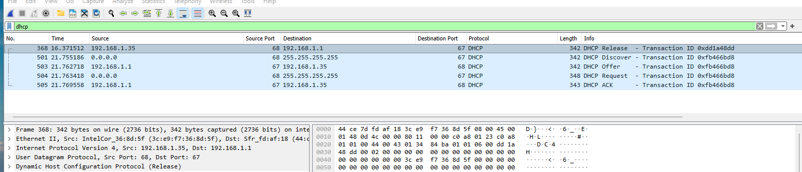

## 2. qu’est ce que le `DHCP Starvation` / `snooping` ? `Rogue DHCP` ?

**DHCP Starvation** = attaque qui **épuise toutes les adresses IP disponibles** d’un serveur DHCP.

**Objectif** = Créer une attaque de déni de service (DoS) sur le réseau local. Souvent c'est un préambule à une attaque MITM : déployant ensuite un faux serveur DHCP **(Rogue DHCP)** pour fournir des IP frauduleuses aux vraies machines.

### Principe:

1. Envois **des requêtes DHCP Discover** massives.
2. Chaque requête utilise une **adresse MAC falsifiée (spoofée)**. (Le serveur DHCP croit qu’il s’agit de nouveaux clients légitimes).
3. Le serveur DHCP attribue toutes ses adresses disponibles à ces fausses MACs.
4. Résultat : **plus aucun client réel ne peut obtenir d’adresse IP.**

## 3. Que ce passe-t-il lors de l'execution de la commande `ipconfig /release` (windows) ? D’un point de vue sécurité quel peut être l'enjeu ?

La commande `ipconfig /release` :

- libère IPv4 et envoie DHCPRELEASE si possible.
- Retire l’adresse IP, la passerelle et les DNS de l’interface locale.
- L’interface devient « sans adresse » (0.0.0.0) jusqu’à un `ipconfig /renew`.
- ça déclenche un nouveau DORA complet.

D'un point de vue de la sécurité, je suis exposé à un "Roughe DHCP" si un faux serveur m'attribue un nouveau ip pour l'interception du trafic, redirection, etc.

## 4. Quelle fonctionnalité propose CISCO pour se prémunir des `attaques DHCP` ?

### **DHCP Snooping**

Est une fonctionnalité de sécurité Cisco qui protège contre Rogue DHCP et attaques DHCP Starvation.

Fonction principale

- Filtrer les réponses DHCP (Offers/ACK) sur le réseau.
- Seuls les ports “trustés” (où le vrai serveur DHCP est connecté) peuvent envoyer des réponses DHCP.
- Tous les autres ports sont considérés comme non trustés, et les offres DHCP venant de ces ports sont bloquées.
- Crée une base de données des bindings MAC/IP, utilisée aussi pour IP Source Guard et ARP inspection.
- Limite le nombre de requêtes par port pour éviter la DHCP Starvation.

Exemple en CLI

    Switch(config)# ip dhcp snooping
        Switch(config)# ip dhcp snooping vlan 10
        Switch(config)# interface GigabitEthernet0/1
        Switch(config-if)# ip dhcp snooping trust   # port du vrai serveur DHCP
        Switch(config-if)# exit
        Switch(config)# interface range GigabitEthernet0/2-24
        Switch(config-if-range)# ip dhcp snooping limit rate 10  # limite pour clients

## 5. Capturer une `requête DNS` et sa réponse

Voici une requête DNS en cmd et son résultat dans WS :

- Avec le filtre `dns` sur Wireshark apres avoir fait par exemple un `nslookup simplonline.co` en cmd
- Avant pour être sur que la requête va apparaître sur WS j'ai fait un `ipconfig /flushdns``pour vider le cache.
  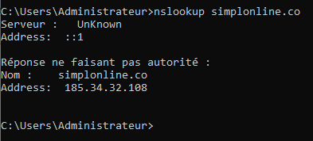
  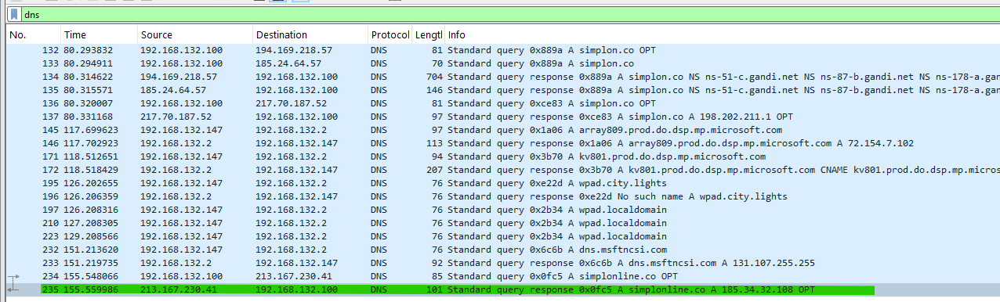

## 6. Qu’est-ce que le `DNS Spoofing` ? Comment s’en protéger ?

- Le DNS Spoofing (ou DNS cache poisoning) est une attaque réseau où un attaquant falsifie les réponses DNS pour rediriger les utilisateurs vers des adresses IP malveillantes.

### Principe

1. Un client fait une requête DNS pour un site légitime (ex. www.google.com).
2. L’attaquant intercepte ou injecte une fausse réponse DNS avant que le vrai serveur ne réponde.
3. Le client reçoit une IP malveillante au lieu de la bonne.
4. Le trafic peut être redirigé vers un site phishing, une page infectée pour installer un malware où un serveur contrôlé par l’attaquant par exemple.

| Type                               | Description                                                                                                                     |
| ---------------------------------- | ------------------------------------------------------------------------------------------------------------------------------- |
| **Cache poisoning**          | L’attaquant remplit le cache DNS d’un serveur avec de fausses entrées. Tous les clients utilisant ce serveur sont impactés. |
| **Man-in-the-Middle (MITM)** | L’attaquant répond directement au client avec de fausses IP. Souvent combiné avec ARP spoofing ou Rogue DHCP.                |
| **Local DNS spoofing**       | Modifie le fichier `hosts` ou le résolveur local pour rediriger les requêtes.                                               |

### Protection

- **DNSSEC** pour signer les réponses DNS.
- **DNS over HTTPS/TLS** pour chiffrer et authentifier les requêtes.
- Surveiller et limiter les accès aux serveurs DNS.
- Mettre à jour régulièrement les caches et correctifs DNS.

## 7. Qu’est-ce que `DNSSec` ? `DNS over TLS` ou `DNS over HTTPS` ?

### A. DNSSEC

**(DNS Security Extensions) a pour but d'assurer que la réponse DNS est authentique et intégrale.**

- Ajoute des signatures cryptographiques aux enregistrements DNS.
- Le client ou résolveur peut vérifier que la réponse vient bien du serveur autorisé et n’a pas été modifiée.
- Ne chiffre pas le contenu, il garantit seulement l’authenticité.

### B. DNS over TLS (DoT)

**Son objectif est de protéger la confidentialité des requêtes DNS.** (nécessite que le serveur DNS supporte DoT.)

- Tout le trafic DNS est chiffré via TLS
- Empêche les attaquants sur le réseau de voir ou manipuler les requêtes DNS.
- Le résolveur et le client établissent une connexion TLS sécurisée avant de s’échanger les requêtes/réponses DNS.

### C. DNS over HTTPS (DoH)

**Donne de la confidentialité et contournement des censures ou interceptions.**

- Le trafic DNS est encapsulé dans HTTPS (port 443).
- Avantage : difficile à bloquer ou filtrer, même sur des réseaux qui inspectent le trafic.
- Les clients modernes (navigateurs comme Firefox ou Chrome) peuvent utiliser DoH directement, souvent vers Cloudflare, Google, etc.

Différence avec DoT :

- DoT est un protocole dédié au DNS sur TLS.
- DoH est DNS encapsulé dans HTTPS, souvent utilisé par les applications pour contourner le filtrage réseau.

## 8. Dans quels cas trouve-t-on du DNS sur TCP ?

### *Cas où le DNS passe sur TCP :*

### A. Réponses trop volumineuses pour UDP

UDP DNS est limité à ~512 octets (ou 1232 octets avec EDNS0).

Si la réponse dépasse cette taille, le serveur indique au client de réessayer en TCP.

Exemple : enregistrements DNS avec DNSSEC ou très longs (TXT, SPF, DNSKEY).

### B. Zone transfers (AXFR/IXFR)

Lorsqu’un serveur secondaire récupère la zone complète d’un serveur primaire.

Nécessite TCP pour transfert fiable de gros volumes.

### C. Fiabilité / contrôle de flux

Certaines configurations peuvent préférer TCP si le réseau est instable ou pour assurer que les réponses arrivent correctement.

### D. Détection et mitigation de certaines attaques

Certains serveurs DNS forcent TCP pour éviter les amplifications DDoS via UDP.

## 9.  Capturer un flux `HTTP`

Flux `http` depuis l'interface **lo (loopback)** dans la machine serveur qui héberge Vulnerablelightapp :

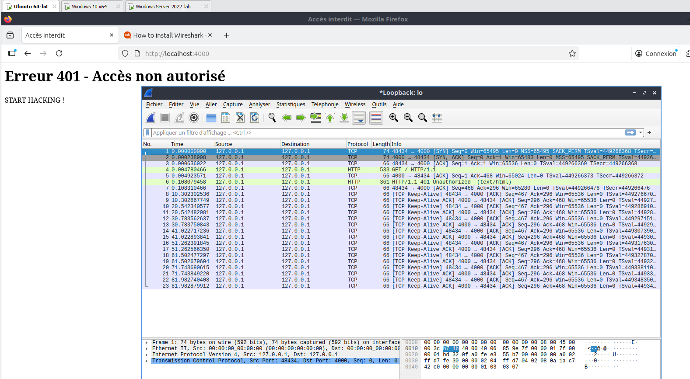
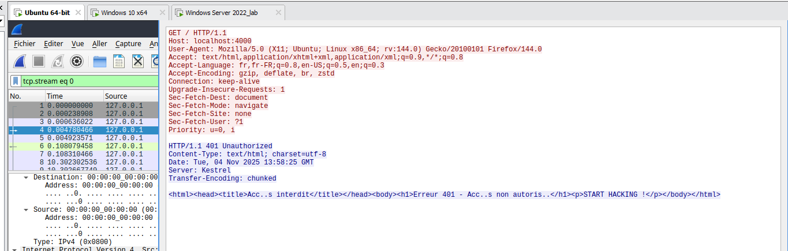

## 10. Qu’est-ce que le `HTTP Smuggling` ? Donner un exemple de `CVE`

- HTTP Request Smuggling = attaque qui exploite des **différences d’interprétation des en-têtes de longueur (Content-Length / Transfer-Encoding) entre un composant HTTP en frontal (proxy, WAF, CDN) et un serveur en arrière-plan.**
- **Résultat :** désynchronisation du flux de requêtes entre les deux et possibilité d’injecter / réacheminer des requêtes non voulues.
- **Principe résumé** :

  - Client envoie une suite de requêtes HTTP sur la même connexion TCP.
  - Le proxy et le serveur backend n’interprètent pas de la même façon où s’arrête une requête et où commence la suivante (par ex. Content-Length vs Transfer-Encoding: chunked).
  - Un attaquant place des en-têtes ambigus. Le proxy considère qu’une requête s’achève à X octets, le backend à Y. Les octets « restants » sont traités comme une nouvelle requête au backend.
  - Cette « désynchronisation » permet d’induire le backend à exécuter des requêtes contrôlées par l’attaquant (bypass d’auth, cache poisoning, etc.).
- ### Exemple de CVE : CVE-2025-55315


  - C'est est une faille critique d’HTTP Request Smuggling dans ASP.NET Core (serveur Kestrel). Elle permet de désynchroniser l’analyse des limites de requêtes entre composants HTTP et d’injecter des requêtes « cachées ».

## 11. Comment mettre en place la confidentialité et l'authenticité pour HTTP ?

Pour HTTP, la confidentialité et l’authenticité s’obtiennent en ajoutant une couche de sécurité : TLS (Transport Layer Security).
Cela transforme HTTP → HTTPS :

- Confidentialité :
  - Les données sont chiffrées avec une clé de session négociée entre client et serveur : Empêche l’écoute (sniffing) et le vol de mots de passe ou cookies.
- Authenticité :
  - Le serveur envoie son certificat X.509 signé par une autorité de certification (CA).
  - Le client (navigateur) vérifie cette signature à l’aide de la chaîne de confiance (CA racine, intermédiaire, etc.). Si la signature et le nom de domaine correspondent, l’identité du serveur est validée.
- Intégrité :
  - TLS assure aussi que les données ne sont pas modifiées en transit (HMAC ou AEAD).

**Mise en place pratique**

- Sur un serveur web :

  - Générer une clé privée et une demande de certificat (CSR).

    openssl req -new -newkey rsa:2048 -nodes -keyout site.key -out site.csr
  - Obtenir un certificat signé (ex. via Let’s Encrypt, gratuit).

    sudo certbot --nginx -d tonsite.fr
  - Configurer le serveur (Apache, Nginx, etc.) pour écouter en 443 avec :

    listen 443 ssl;
    ssl_certificate /etc/letsencrypt/live/tonsite.fr/fullchain.pem;
    ssl_certificate_key /etc/letsencrypt/live/tonsite.fr/privkey.pem;
  - Rediriger HTTP (port 80) vers HTTPS.
- Authentification renforcée (optionnelle)

  - Mutual TLS (mTLS) : le client aussi présente un certificat.
  - HTTP Auth / OAuth / JWT : ajout d’authentification applicative par dessus HTTPS.

## 12.  Qu’est-ce qu’une `PKI` ?

PKI = **Public Key Infrastructure** (infrastructure à clé publique).

C’est l’ensemble de mécanismes, personnes et procédures permettant d’émettre, distribuer, vérifier et révoquer des certificats numériques.

### Composants essentiels :

- **Autorité de certification (CA) :** Entité qui signe les certificats pour garantir l’identité d’un serveur ou d’un utilisateur.Elle utilise sa clé privée pour signer et sa clé publique est connue de tous.
- **Autorité d’enregistrement (RA)** : Vérifie l’identité des demandeurs avant que la CA ne signe leurs certificats.
- **Serveur de certificats / répertoire** Stocke et publie les certificats et listes de révocation (CRL)
- **Listes de révocation (CRL) et OCSP** : Permettent de vérifier si un certificat a été annulé.
- **Certificat numérique (X.509)** Contient la clé publique, l’identité du titulaire, la signature de la CA, et les dates de validité.

### **Schéma logique:**

    [Utilisateur/Serveur] → CSR → [RA/CA]
    [CA] → Certificat signé → [Utilisateur/Serveur]
    [Client] → Vérifie signature avec CA → Confiance

## 13. Capturer un `mot de passe` HTTP via le projet VulnerableLightApp.

**Modification du login et mdp avec Swagger :**

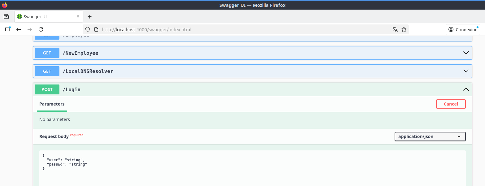

**MDP en clair dans le flux HTTP**

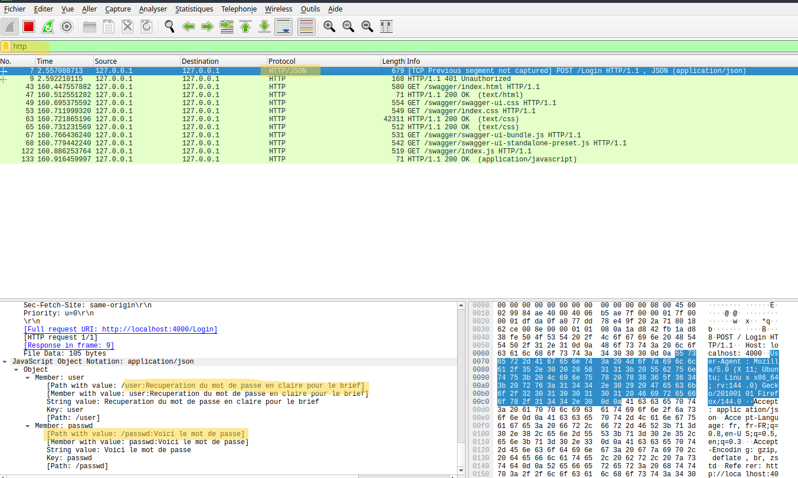

## 14. Comment mettre en place la `confidentialité` pour ce service ?

## Confidentialité pour `http`

* On met la **confidentialité** en place pour HTTP en ajoutant une couche **TLS** → cela devient  **HTTPS** . Pour cela on va générer une clé privée et un certificat et en suite configurer le serveur web par exemple.

  * **Paire clé privée / clé publique**

    * La clé privée signe et doit rester secrète. La clé publique est distribuée dans le certificat et permet au client de vérifier l’identité et d’établir la clé de session TLS.
  * Exemple, une **Certificat X.509**

    * Contient : sujet (CN, SANs), clé publique, période de validité, extensions (Key Usage, Extended Key Usage), et la **signature** (ici auto-signée). Les clients font confiance si la signature est validée par une CA de confiance.
  * **Auto-signé vs CA**

    * Auto-signé (`-x509`) utile en test.
    * En production, utiliser une **CA** (Let’s Encrypt, commercial). Le navigateur valide la chaîne de confiance. Sinon warning navigateur.
  * **CN et SAN**
  * Le **Common Name (CN)** était historiquement le nom du domaine. Aujourd’hui il faut surtout renseigner les  **Subject Alternative Names (SAN)** . Beaucoup de clients ignorent le CN si les SAN sont présents
  * **Algorithme et taille de clé**

    * RSA 2048 : standard minimal. Plus de bits = plus de sécurité mais coût CPU.
    * ECDSA (P-256 / P-384) offre sécurité équivalente avec clés plus petites et meilleure perf TLS.
  * **Signature**

    * Le certificat est signé avec une fonction de hachage (ex : SHA-256). OpenSSL choisira par défaut un algorithme moderne si possible.
  * **Protection de la clé privée**

    * Sans `-nodes`, openssl chiffre la clé privée avec une passphrase. C’est plus sûr mais oblige à entrer la passphrase au démarrage du service ou utiliser un agent de clés.
    * Restreindre les permissions du fichier : `chmod 600 server.key` et appartenir à l’utilisateur du service.
* Exemple pour un test local :

  * ```
        openssl req -x509 -newkey rsa:2048 -keyout server.key -out server.crt -days 365 -nodes
    ```
  * `openssl`

    L’outil en ligne de commande pour la crypto (OpenSSL).
  * `req`

    Sous-commande pour créer une **CSR** (Certificate Signing Request) ou manipuler des demandes de certificats X.509.
  * `-x509`

    Au lieu de générer une CSR, produit **directement un certificat auto-signé** X.509. Utile pour tests. En production on enverra la CSR à une CA.
  * `-newkey rsa:2048`

    Génère  **une nouvelle paire de clés** . `rsa:2048` demande une clé RSA de 2048 bits.

    Remarque : RSA-2048 est le minimum acceptable aujourd’hui. On peut préférer `rsa:3072` ou ECDSA (`ec: -pkeyopt`) pour meilleure sécurité/perf.
  * `-keyout server.key`

    Fichier où sera écrit la **clé privée** (PEM, non chiffrée par défaut ici).
  * `-out server.crt`

    Fichier de sortie contenant le **certificat X.509** (PEM).
  * `-days 365`

    Période de validité du certificat en jours. `365` = 1 an. Pour prod, privilégier renouvellement automatisé (Let’s Encrypt 90 jours).
  * `-nodes`

    **No DES** . Ne chiffre pas la clé privée par une passphrase. Utile pour serveurs automatisés (démarrage sans interaction). Risque : si le fichier fuit, la clé privée est immédiatement exploitable
* **Configurer le serveur web**

  Exemple Nginx :

  ```
  server {
      listen 443 ssl;
      server_name localhost;

      ssl_certificate     /etc/ssl/server.crt;
      ssl_certificate_key /etc/ssl/server.key;

      location / {
          proxy_pass http://127.0.0.1:4000;
      }
  }
  ```

## 15. Capturer un `handshake TLS`

Voici une capture du handshake avec Wireshark quand on rentre dans https://localhost:3000 dans la VM où Vulnerablelightsapp est en execution :
filtre = `tls.handshake`
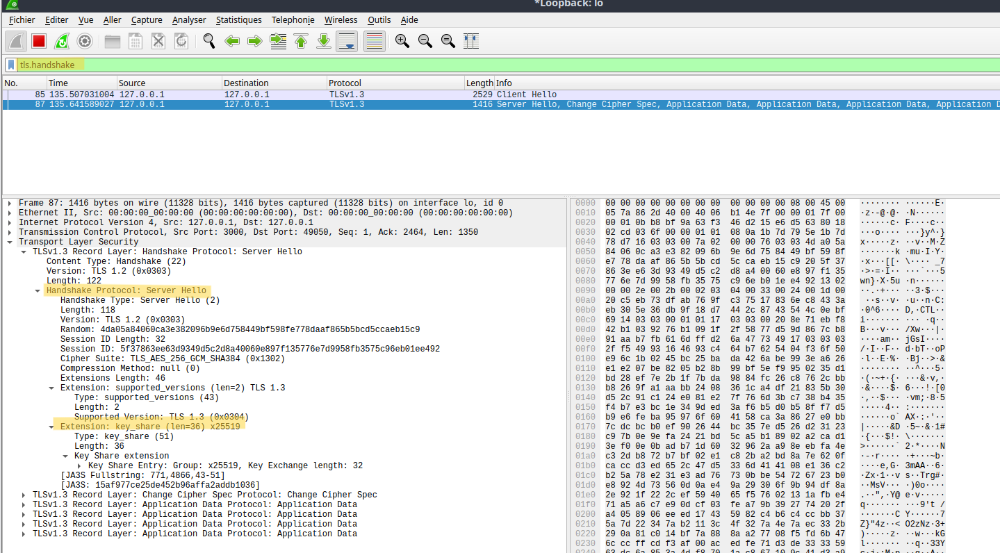

## 16. Qu’est-ce qu’une autorité de certification (`AC`) racine ?

  **Une autorité de certification (AC) racine est l’entité de plus haut niveau dans une hiérarchie de certificats numériques.**

  Elle signe ses propres certificats (autocertification) et délivre des certificats à des autorités intermédiaires ou directement à des entités finales (serveurs, utilisateurs, applications).

- Son certificat racine est auto-signé.
- Il est préinstallé dans les systèmes d’exploitation, navigateurs, et appareils de confiance.
- Sa compromission invalide toute la chaîne de confiance associée.

**Par exemple,**

- ISRG Root X1, l’autorité de certification racine utilisée par Let’s Encrypt.

Fonctionnement :

1. Création du certificat racine
   L’AC racine génère sa propre paire de clés (publique/privée) et crée un certificat auto-signé.
2. Distribution de confiance
   Ce certificat racine est intégré dans les systèmes (Windows, macOS, navigateurs, etc.). Ainsi, tout certificat signé par elle (ou par une AC intermédiaire qu’elle approuve) sera reconnu comme fiable.
3. Délégation
   L’AC racine signe les certificats des AC intermédiaires. Ces dernières délivrent ensuite les certificats finaux (sites web, entreprises, etc.).
4. Validation
   Lorsqu’un utilisateur visite un site HTTPS, le navigateur vérifie la chaîne de confiance : Certificat du site → AC intermédiaire → AC racine

## 17. Qu'est qu'une `AC intermediaire` ?

  Une autorité de certification intermédiaire (AC intermédiaire) est une entité déléguée par l’AC racine pour émettre des certificats à des serveurs ou utilisateurs.

Fonctionnement pratique :

**1. Signature par la racine**

- L’AC racine signe le certificat de l’AC intermédiaire, ce qui lui confère la légitimité d’émettre d’autres certificats.

**2. Émission de certificats**

- L’AC intermédiaire délivre des certificats SSL/TLS à des sites web, entreprises, ou services. Elle fait le travail opérationnel à la place de la racine, qui reste isolée pour des raisons de sécurité.

**3. Chaîne de confiance**
Lorsqu’un navigateur reçoit un certificat d’un site, il vérifie la chaîne :

```
Certificat du site
    ↓
Certificat AC intermédiaire
    ↓
Certificat AC racine (préinstallé)
```

Si chaque maillon est valide et signé correctement, le certificat du site est accepté.

**4. Avantage**

- Si une AC intermédiaire est compromise, seule cette branche est révoquée. L’AC racine reste intacte.

**Exemple :**
R3 est une AC intermédiaire utilisée par Let’s Encrypt, signée par ISRG Root X1.

## 18. Connectez-vous sur `taisen.fr` et affichez la `chaine de confiance` du certificat

Voici la chaîne de confiance du site :

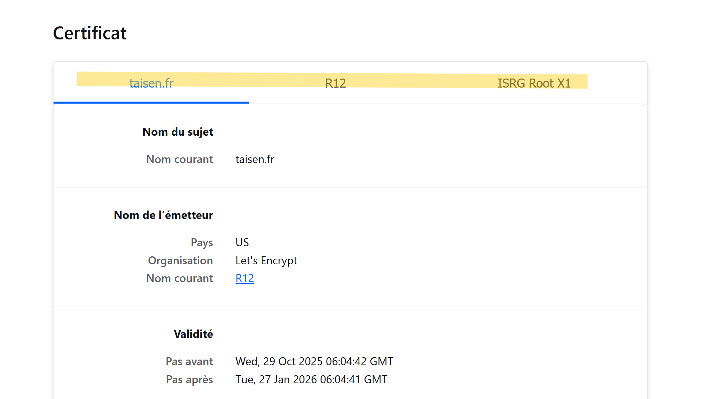

- Certificat du site : taisen.fr
- AC Intermédiaire : R12
- AC racine : ISRG Root X1

## 19. Capturer une authentification `Kerberos` (mettre en place le service si nécessaire), identifier l'`AS_REQ`, `AS_REP` et les messages suivants.

Pour filtrer le trafic Kerberos dans Wireshark (Windows Serveur) :
Filtres:

- kerberos

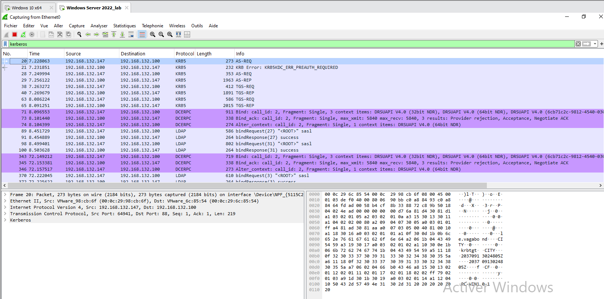

## AS-REQ et AS-REP : Le Processus d'Authentification Initial

AS-REQ (Authentication Service Request) et AS-REP (Authentication Service Response) sont les deux premières étapes de l'échange Kerberos. Leur rôle est d'authentifier un utilisateur (ou un service) auprès du KDC (Key Distribution Center, généralement votre Contrôleur de Domaine Active Directory) et de lui fournir un ticket d'accès de base.

- AS-REQ (Request)	Client → KDC

  La demande faite par le client (utilisateur) au KDC. Le client envoie son nom d'utilisateur (Principal) et un horodatage chiffré avec son mot de passe (ou hash).

  AS-REQ	10	kerberos.msg_type == 10
  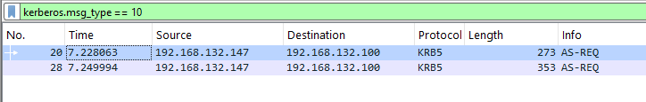
- AS-REP (Response) KDC → Client

  La réponse du KDC. S'il valide l'utilisateur, le KDC envoie deux choses : 1) Une clé de session chiffrée avec le hash du mot de passe de l'utilisateur. 2) Un TGT (Ticket-Granting Ticket) chiffré avec la clé secrète du KDC.

  AS-REP	11	kerberos.msg_type == 11
  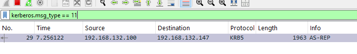

En résumé, cet échange permet au client d'obtenir le TGT, qui est l'équivalent d'un passeport pour le domaine. Le client utilisera ensuite ce TGT dans l'échange suivant (TGS-REQ/TGS-REP) pour demander des tickets spécifiques pour accéder aux services réseau (comme les lecteurs réseau SMB).

## 20. Capturer une `authentification RDP` (mettre en place le service si nécessaire), quel est le protocole d'authentification capturé ?

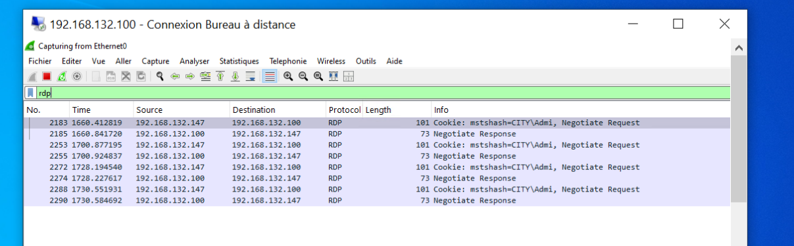
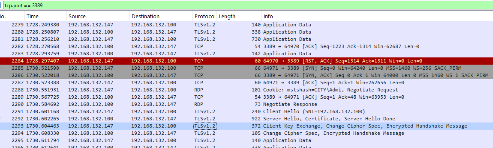

### Protocole RDP (Remote Desktop Protocol)

**Transport : RDP utilise le port TCP 3389 par défaut.**

**Chiffrement :** Les versions modernes de RDP utilisent généralement le chiffrement TLS/SSL (ou NLA/CredSSP basé sur Kerberos) pour sécuriser l'ensemble de la session, y compris les données d'identification et le trafic de la session.

**Contenu :** RDP n'envoie pas de flux vidéo brut ; il envoie des mises à jour graphiques (vecteurs, bitmaps compressés), des entrées utilisateur (clavier, souris), et gère les transferts de presse-papiers, les flux audio et la redirection des imprimantes.

La chose la plus importante à savoir lors de la capture RDP est que la charge utile (les données graphiques, les frappes de clavier, etc.) est généralement chiffrée (TLS/SSL).

**Résultat :** Sans la clé privée du serveur RDP, on ne peut pas voir le contenu des mises à jour graphiques, ni intercepter les identifiants si l'authentification se fait via TLS.

Ce que on vois en WS : La négociation de la connexion (établissement TCP, handshake TLS/SSL) et le flux continu de données chiffrées échangées entre le client et le serveur.

Filtres Wireshark pour RDP :

- Trafic RDP	tcp.port == 3389
- Trafic RDP et TLS	tcp.port == 3389 or ssl
- Connexion Client/Serveur	host [IP_client] and host [IP_serveur] and tcp.port == 3389

## 21. Quelles sont les attaques connues sur `NetLM` ?

**NetLM** (qui désigne la famille de protocoles NTLM - NT LAN Manager, et inclut les anciennes versions LM et NTLMv1) est un protocole d'authentification hérité de Microsoft qui présente de nombreuses faiblesses inhérentes à sa conception cryptographique.

Le protocole NTLM est la cible de plusieurs attaques bien connues, utilisées dans les tests d'intrusion et par les attaquants pour le vol d'identifiants, l'élévation de privilèges et le mouvement latéral sur le réseau.

**Exemples :**

- ### Attaques par Relais NTLM (NTLM Relay Attacks)
- ### Attaques par "Pass-The-Hash" (PtH)
- ### Divulgation de Hachage Forcée (NTLM Hash Disclosure)

## 22. Capturer une `authentification WinRM` (Vous pouvez utiliser EvilWinRM si nécessaire côté client.), quel est le protocole d'authentification capturé ?

Dans un environnement Active Directory, l'authentification se fait via Kerberos ou NTLM (si Kerberos échoue). Ces protocoles sont encapsulés dans le trafic HTTP(S) WinRM.

WinRM (Windows Remote Management) utilise par défaut HTTP(S) avec une authentification basée sur WS-Man (Web Services for Management). Mais ça dépend de la configuration :

- NTLM si les machines ne sont pas dans un domaine.
- Kerberos si elles sont dans le même domaine Active Directory.
- Basic si configuré explicitement (rare et non sécurisé, sauf sur HTTPS).

**Voici l'authentification WinRM avec kerberos capturé par Wireshark :**

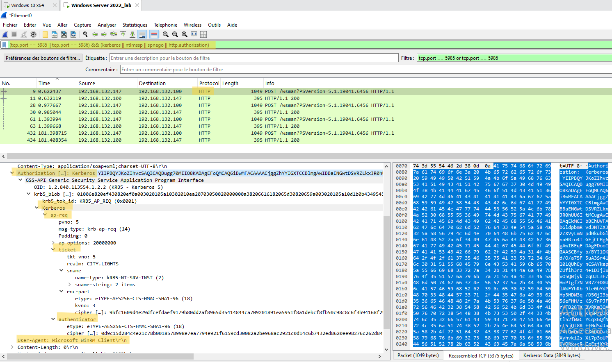

## 23.  Capturer une `authentification SSH` ou SFTP (mettre en place le service si nécessaire)

Le trafic SSH est entièrement chiffré dès le début de la connexion. Avec Wireshark, on vois :

**La négociation du protocole (échange de versions)**

- SSH Protocol: SSH-2.0-OpenSSH_X.X
- des paquets avec le flag [PSH, ACK]
- Le client et le serveur s'envoient leur version SSH en texte clair

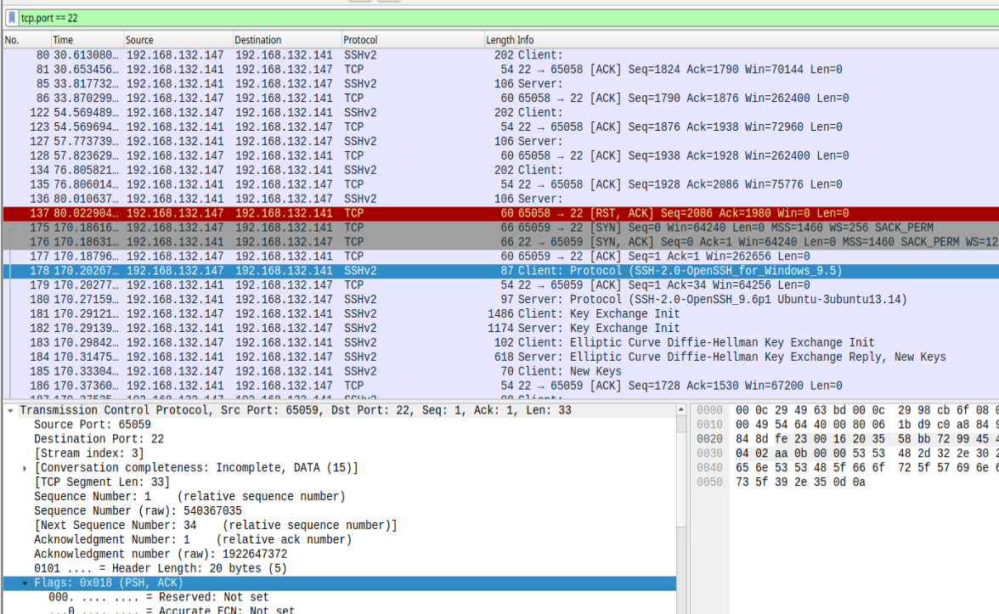

**L'échange de clés (Key Exchange)**

- Client: Key Exchange Init et Server: Key Exchange Init
- Dans SSH Protocol → SSH Message Type: Key Exchange Init (20)
- algorithmes proposés

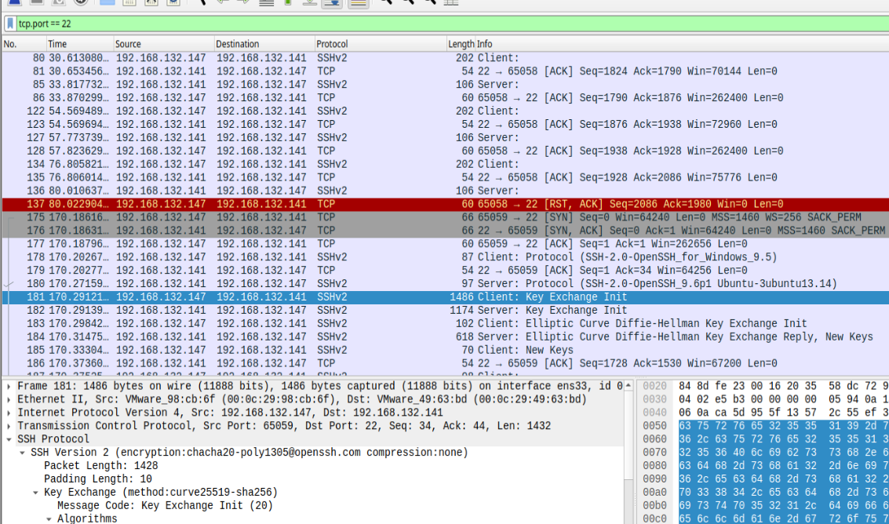

**Les données chiffrées**

- Encrypted packet (len=XXX)

Je ne peu pas voir :

- Le mot de passe en clair
- Les commandes tapées
- Les données authentiques transmises

## 24.  Intercepter un `fichier au travers du protocole SMB`

Envoi d'un fichier avec le partage entre Windows Client et Windows Serveur:


Filtre Wireshark pour la capture:
 tcp.port == 445 ou tcp.port == 139


SMB2 sans chiffrement : j'ai pu extraire le text du  fichier facilement "Exemple du text" dans Data :

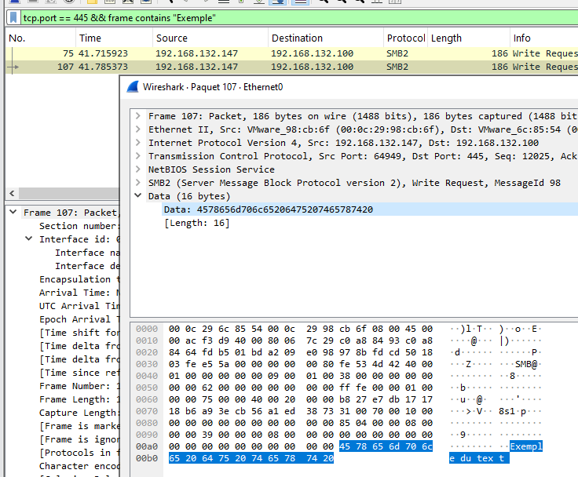

## 25.  Comment proteger l'`authenticité` et la `confidentialité` d'un partage SMB ?

Pour protéger l'authenticité et la confidentialité d'un partage SMB :

- **AUTHENTICITÉ (vérifier l'identité) :**

  - Désactiver SMB1 : utiliser uniquement SMB2/SMB3 (SMB1 a des failles)
  - Authentification forte : utiliser Kerberos (Active Directory) plutôt que NTLM
  - Signature SMB : activer la signature des paquets SMB
    - Force les paquets à être signés cryptographiquement
    - Empêche les attaques man-in-the-middle et la falsification
    - Paramètre : "Microsoft network server: Digitally sign communications (always)"
- **CONFIDENTIALITÉ (protéger les données) :**
- Chiffrement SMB3 : activer le chiffrement de bout en bout

  - Disponible depuis SMB3.0 (Windows 8/Server 2012)
  - Chiffre toutes les données en transit
  - Paramètre : "Encrypt data access" sur le partage
- SMB over QUIC : utiliser SMB sur QUIC (Windows Server 2022+) avec TLS 1.3

**Configuration recommandée :**

- Forcer SMB3 minimum
- Activer la signature obligatoire
- Activer le chiffrement sur les partages sensibles
- Utiliser des comptes avec mots de passe forts
